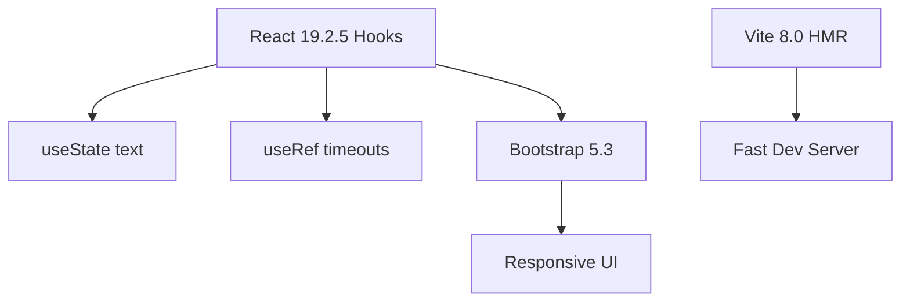

# 🌟 **Text Analyzer** - Advanced Animated Text Utility by **Intiyaj Ansari**

[](https://react.dev)
[](https://vitejs.dev)
[](https://getbootstrap.com)
[](https://github.com/)

<div align=\"center\">

## 🎬 **Live Demo Animations**


**Intiyaj Ansari's Text Analyzer – Transform Text with Magic! ✨**

</div>

## 🚀 **Features** _(Fully Implemented & Animated)_

| 🎯 **Action**  | ✨ **Effect**               | 🎪 **Animation**                                     |
| -------------- | --------------------------- | ---------------------------------------------------- |
| **Uppercase**  | `text.toUpperCase()`        | Instant transform                                    |
| **Lowercase**  | `text.toLowerCase()`        | Instant transform                                    |
| **Capitalize** | Title case per word         | Smart word-by-word                                   |
| **Clean Text** | `split(/\\s+/).join(\" \")` | Extra spaces removed                                 |
| **Copy**       | `navigator.clipboard`       | ✅ Success alert                                     |
| **Clear**      | Reset with timeout          | 3s → \"Kuchh to type karo yaar 😀\" → 5s sample text |

**Live Analysis**: Words, Characters, Preview _(debounced typing)_

<div align=\"center\">

<i>Dark theme card with shadows & responsive buttons</i>
</div>

## 🛠 **Tech Stack**



- **Performance**: Debounced onChange, timeout clears
- **Zero extra deps**: Pure React + Bootstrap CDN
- **Custom**: Blue gradient bg, black shadows

## 👨‍💻 **About the Developer**

**Intiyaj Ansari** - BTech Student & Frontend Enthusiast  
**Skills**: HTML/CSS/JS • Projects: Text Analyzer, Movie Booking, Portfolio  
🔍 [Google \"Intiyaj Ansari\"](https://www.google.com/search?q=Intiyaj+Ansari)

## ⚡ **Get Started** (2 mins)

```bash
git clone <your-repo> text-analyzer
cd text-analyzer
npm install
npm run dev  # http://localhost:5173
```

**Production**: `npm run build` → `dist/`

## 📹 **Usage Flow**

```
Paste Text → Live Count → Click Transform → Copy/Clear!
↓
Animation: Clear → Emoji message → Auto-reset 😍
```

## 🤝 **Contribute**

```
1. Fork → Clone
2. npm install & npm run dev
3. Add feature (new transform?)
4. PR with description
```

## 📄 **License**

[MIT](LICENSE) © 2024 **Intiyaj Ansari**

<div align=\"center\">
Made with ❤️ **#FrontendDev #React #Animations**  
⭐ **Star & Follow Intiyaj Ansari!**
</div>
